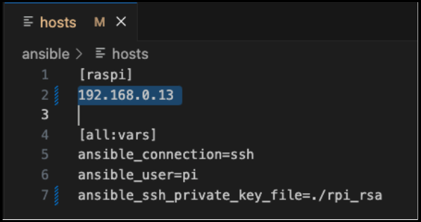
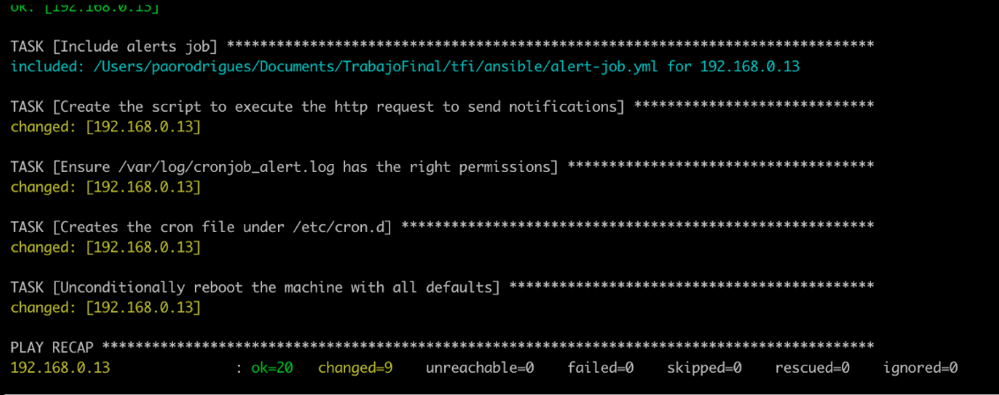

# Trabajo Final Integrador - Raspberry Pi


## Introducción
Este repositorio contiene la configuración del trabajo final **Análisis, visibilidad de tráfico y seguridad para usuarios finales en redes hogareñas**.

En este repositorio se encuentra:
* La configuración inicial de la Raspberry Pi
* La configuración de la Raspberry Pi como _Access Point_
* La configuración del _token_ de Github para poder clonar los repositorios del _backend_ y del _frontend_
* La instalación de la herramienta de monitoreo de tráfico
* El despliegue de los _cron jobs_ que ejecutan llamadas programadas a la _API_ para guardar información en la base de datos

Al finalizar con la ejecución de este repositorio, se tendrá el ambiente preparado para el despliegue del [backend](https://github.com/PaoGRodrigues/tfi-backend) y del [frontend](http://github.com/PaoGRodrigues/tfi-frontend).

## Instalación
### Prerrequisitos
* Una Raspberry Pi 
* Un teclado, un mouse y un monitor para instalar el sistema operativo en la Raspberry
* Una computadora para la descarga de la imagen del sistema operativo de la Raspberry (Nota: para este caso, se usará una MacBook Pro).
* Una tarjeta microSD
* Un adaptador para microSD
* Un cable HDMI y un cable Ethernet
* Un celular con Telegram
* Permisos sobre los repositorios de código de Github

### Configuración inicial
Para la instalación del sistema operativo y el acceso remoto en la Raspberry, ver [Configuración inicial](docs/configInicial.md).

### Configuración con Ansible
#### Configurar el _Access Point_ 
1. En la computadora local, instalar Git y ansible.
2. Clonar este repositorio donde se encuentra el archivo **yml** que contiene la configuración que se va a aplicar. Cuando pida usuario y contraseña, indicar el usuario y el token creado en el paso Configuración del token de Github.
    ```$ git clone https://github.com/PaoGRodrigues/tfi```
3. Mover la llave privada a la carpeta ansible.
4. Modificar el archivo hosts por la IP de la Raspberry (y el nombre de la llave privada en caso de haberle cambiado el nombre al archivo).

    

5. Chequear la conexión con la Raspberry respecto al host y la llave especificados
    ```$ ansible -i hosts raspi -m ping```
6. Para aplicar las configuraciones que contienen los archivos, ejecutar el siguiente comando.
    ```
    $ ansible-playbook router.yml 
    $ -e "country_code_arg=AR ssid_arg=Test wpa_passphare_arg=Argentina22"
    ```
    Cambiar **ssid_arg** y **wpa_passphare_arg** por el nombre de la red y la contraseña que se desee.

7. Al finalizar la configuración, se debe ver lo siguiente
    
    

    A partir de esta configuración, se verá que las interfaces quedaron configuradas como:
    * Eth0: 192.168.0.13/24.
    * Wlan0: 192.168.4.1/24.

#### Deploy de los jobs
**Prerrequisito: Clonar y ejecutar el backend como se indica en [TFI Backend](https://github.com/PaoGRodrigues/tfi-backend)**

Con el backend ya en ejecución, se procede a crear los jobs que estarán configurados para ejecutarse en un momento determinado. Se utiliza otro playbook de Ansible, donde se especifica a qué ruta del backend consulta, cuánto tiene que esperar y dónde tiene que enviar los logs de la salida.
Este playbook crea dos cron jobs:
* Uno que hace un POST a **/hosts** y luego a **/activeflows** para obtener los datos relacionados con dispositivos y tráfico y guardarlo en la base de datos para generar el histórico de ambos.
* Uno que hace POST a /alertnotification que se ejecuta cada cinco (5) minutos, obtiene las últimas alertas recibidas y realiza el envío de notificaciones vía Telegram.

Para crearlos:

1. Dirigirse nuevamente al directorio donde se descargó el repositorio https://github.com/PaoGRodrigues/tfi.
2. Moverse dentro del repositorio hasta el directorio Ansible.
3. Ejecutar en la computadora local, el siguiente comando ```ansible-playbook jobs.yml```

### Configuración del token de Github
Para la configuración de la key de Github en la Raspberry Pi, ver [Configuración key de Github](docs/configKeyGithub.md).

### Instalación de la herramienta de monitoreo
Para la instalación de la herramienta de monitoreo en la Raspberry Pi, ver [Instalación herramienta de monitoreo](docs/configTool.md).